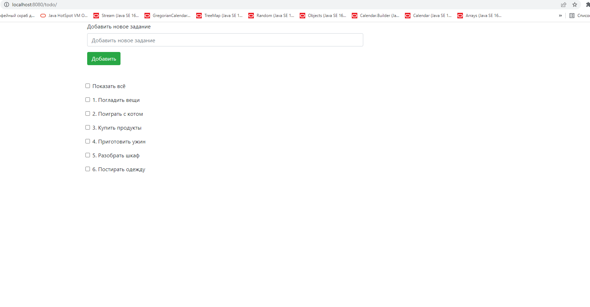
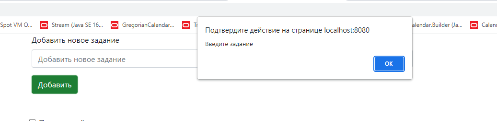
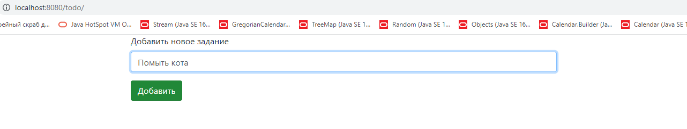
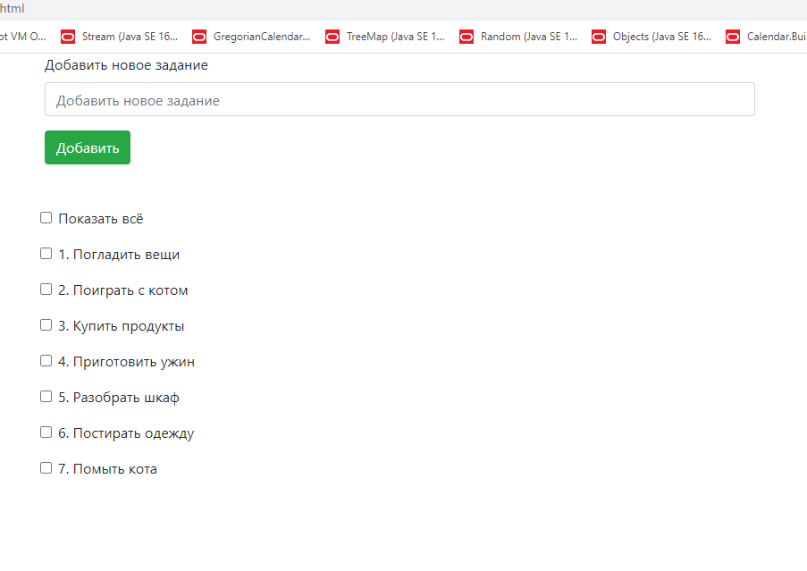
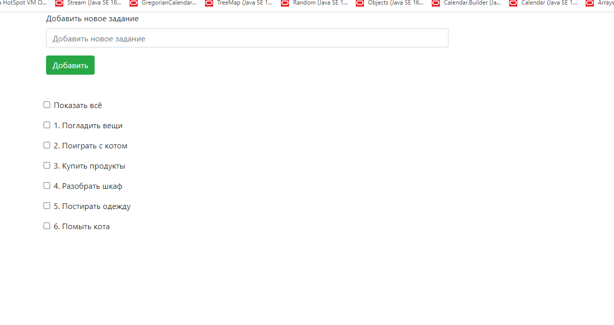
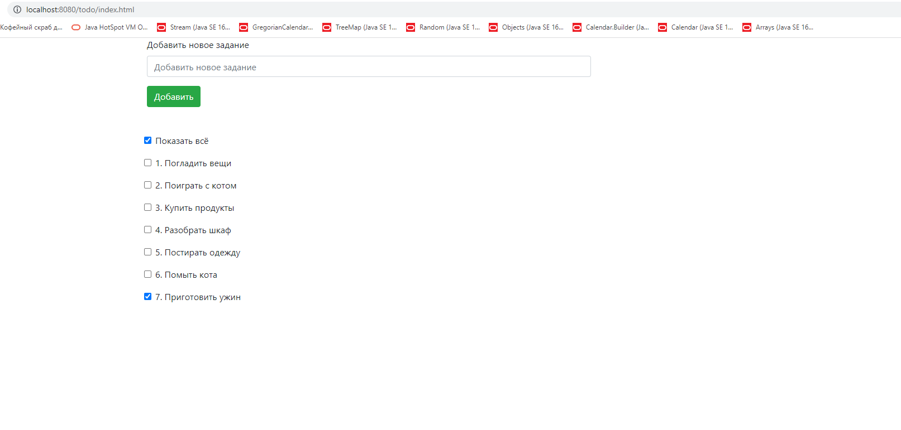
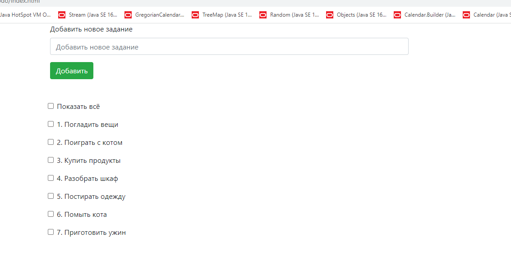

В проекте представлен TODO список.
Приложение имеет одну страницу, в верхней части которого мы видим форму для добавления нового задания, а ниже - сам список заданий.

После нажания на "Добавить" происходит валидация данных, и, если форма осталась незаполненной, пользователю высвечивается окошко с сообщением о необходимости ввести задание.

После того, как задание введено, и пользователь нажал на "Добавить", новое задание добавляется в конец списка.

Когда задание выполнено, его отмечают галочкой, как выполненное, и задание сразу исчезает из списка.

Также сверху от заданий имеется "фильтр". Когда он не отмечен галочкой, пользователь видит только те задания, которые еще не выполнены. Если поставить галочку, то в списке появятся и те задания, которые пользователь пометил ранее, как выполненные.

Пользователь может снять отметку с выполненного задания. Тогда оно снова примет статус "не выполнено" и отобразится в списке при отключенном "фильтре".
